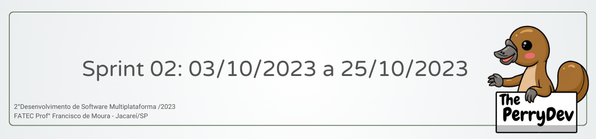
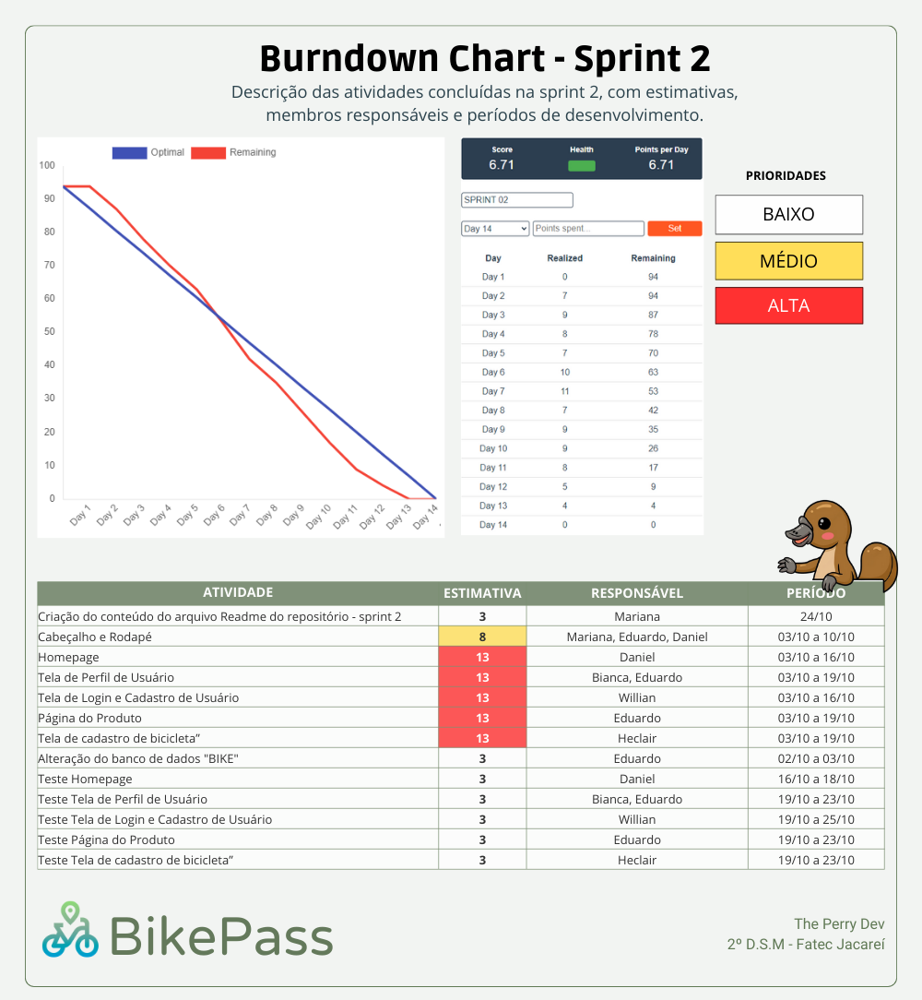

 

 

    <a href="#objetivos">Objetivos da sprint</a> &nbsp |&nbsp &nbsp
    <a href="#entregas">Entregas</a> &nbsp |&nbsp &nbsp
    <a href="#metricas">Métricas do time</a> &nbsp |&nbsp &nbsp

O projeto é constituído  na construção de um site que ofereça serviços de aluguel de bicicletas, que permita que os usuários aluguem ou coloquem bicicletas para locação de acordo com a sua localização. Com base nessa estruturação a sprint 02 consistiu em horas voltadas para o desenvolvimento das páginas do site, assim como os testes e correções das mesmas.

    
## :dart: Objetivos da Sprint
Os requisitos (funcionais e não funcionais) abrangidos por essa sprint são:
- RF 01: Desenvolvimento do Cabeçalho e Rodapé;
- RF 04: Desenvolvimento da Homepage;
- RF 02: Desenvolvimento da tela de perfil do usuário;
- RF 01, 14: Desenvolvimento da tela de login e cadastro do usuário;
- RF 03: Desenvolvimento da tela de produtos;
- RF 11,12,13: Testes e Correções.

→ [Voltar ao topo](#topo)

        
## :heavy_check_mark: Entregas

### Desenvolvimento das telas

Neste requisito, a equipe teve como objetivo o desenvolvimento das telas que serão apresentadas no Front-End, juntamente com o Back-end e integração do Banco de Dados que já havia sido finalizado na Sprint 01.

### Testes e Correções

Após o desenvolvimento de cada tela necessária para o funcionamento da página, foram realizados teste e algumas correções que garantiram o funcionamento de cada tela, além do planejamento de novas correções para a SPrint 03

Sendo asssim, finalizamos os requisitos propostos para esta sprint.

→ [Voltar ao topo](#topo)

 
     
## :chart_with_upwards_trend: Métricas do time
Em prol de um melhor aproveitamento do tempo disponível durante a segunda sprint o time se dividiu em atividades de desenvolvimento das telas da Homepage, Perfil de Usuário, Login e Cadastro do Usuário e dos Produtos, assim como estruturação da equipe para gestão das horas com o gráfico burndown abaixo.
    

    
    
→ [Voltar ao topo](#topo)

→ [Ir para o Projeto](https://github.com/ThePerryDev/bikepass)

→ [Voltar para a página principal ](https://github.com/ThePerryDev)