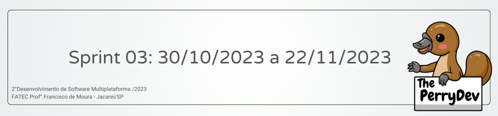
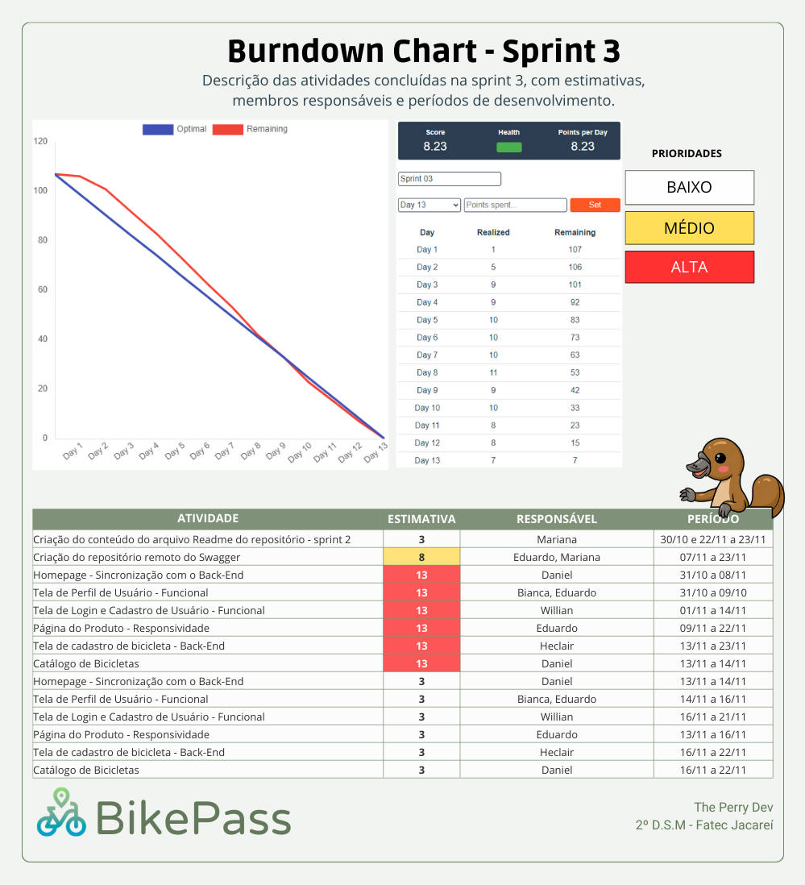

 

 

    <a href="#objetivos">Objetivos da sprint</a> &nbsp |&nbsp &nbsp
    <a href="#entregas">Entregas</a> &nbsp |&nbsp &nbsp
    <a href="#metricas">Métricas do time</a> &nbsp |&nbsp &nbsp

O projeto é constituído  na construção de um site que ofereça serviços de aluguel de bicicletas, que permita que os usuários aluguem ou coloquem bicicletas para locação de acordo com a sua localização. Com base nessa estruturação a sprint 03 consistiu em tornar o site funcional, através da sincronização do Front-end com o Baack-end.

    
## :dart: Objetivos da Sprint
Os requisitos (funcionais e não funcionais) abrangidos por essa sprint são:
- RF 01: Criação do repositório remoto do Swagger
- RF 04: Homepage - Funcional;
- RF 02: Desenvolvimento da tela de perfil do usuário - Funcional;
- RF 01, 14: Desenvolvimento da tela de login e cadastro do usuário - Funcional;
- RF 03: Desenvolvimento da tela de produtos - Funcional;
- RF 11,12,13: Testes e Correções.

→ [Voltar ao topo](#topo)

        
## :heavy_check_mark: Entregas

### 📌 Criação do repositório remoto do Swagger

Neste requisito, a equipe teve como objetivo a criação do repositório remoto no Swagger, para realizado o cadastro de toda documentação do projeto, afim de possuir uma documentação organizada e clara, disponível para a consulta de todos.

### 📌 Tornar a Homepage, tela do perfil do usuário, tela de login e cadastro e tela de produtos

Após o desenvolvimento de cada tela necessária para o funcionamento do site, Homepage, tela do perfil do usuário, tela de login, tela de cadastro de produtos, e tela de produtos foi realizada toda a sincronização de todo Back-end com o Front-end, tornando o site pronto para os testes finais 

### 📌 Testes e Correções

Após o desenvolvimento das telas e a sincronização de todo Back-end com o Front-end, as páginas passaram para os testes finais, onde foram corrigidos os possíveis Bugs, de forma a tornar o projeto todo funcional. 

Sendo asssim, finalizamos os requisitos propostos para esta sprint.

→ [Voltar ao topo](#topo)

 
     
## :chart_with_upwards_trend: Métricas do time
Em prol de um melhor aproveitamento do tempo disponível durante a terceira sprint o time se dividiu em atividades de desenvolvimento e sincronização do Back-end com o Front-end, das telas da Homepage, Perfil de Usuário, Login e Cadastro do Usuário e dos Produtos, assim como estruturação da equipe para gestão das horas com o gráfico burndown abaixo.
    

    
    
→ [Voltar ao topo](#topo)

→ [Ir para o Projeto](https://github.com/ThePerryDev/bikepass)

→ [Voltar para a página principal ](https://github.com/ThePerryDev)